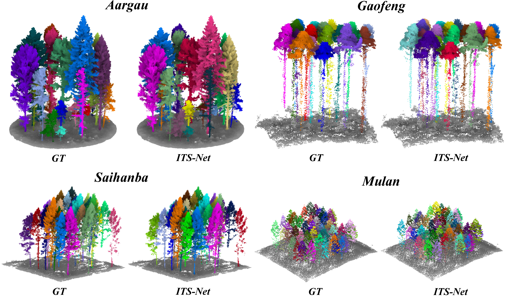
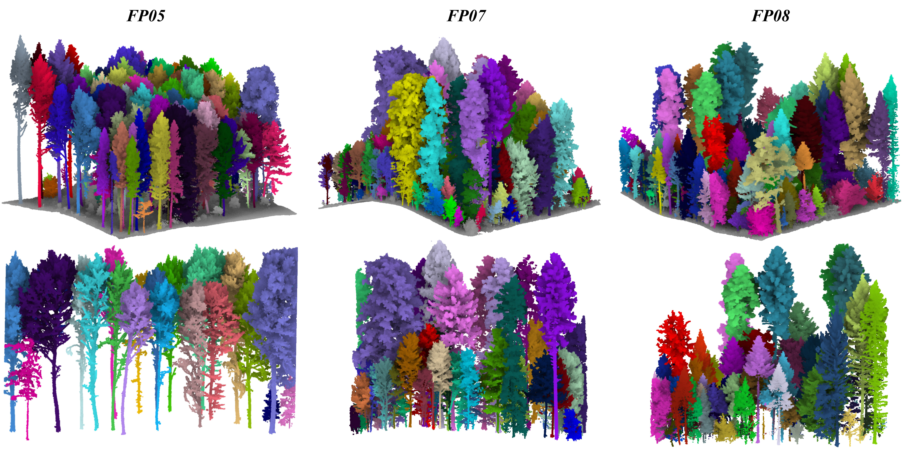

# ITS-Net: a platform and sensor agnostic 3D deep learning model for individual tree segmentation using aerial LiDAR data
This repository is for ITS-Net introduced in following paper:

"ITS-Net: a platform and sensor agnostic 3D deep learning model for individual tree segmentation using aerial LiDAR data"
## (1) Overview
Recent advances in aerial Light Detection and Ranging (LiDAR) technologies have revolutionized the capability to characterize individual tree structure, enabling detailed ecological analyses at the tree level. A critical prerequisite for such analysis is an accurate individual tree segmentation. However, this task remains challenging due to the complexity of forest environments and varying quality of point clouds collected by diverse aerial sensors and platforms. Existing methods are mostly designed for a single aerial platform or sensor and struggle with complex forest environments. To address these limitations, we propose ITS-Net, an aerial platform and sensor-agnostic deep learning model that is tailored for individual tree segmentation. To handle complex forest environments, ITS-Net enhances its learning ability by incorporating heterogeneous features across global spatial and channel perspectives, rather than solely relying on local features. Moreover, to robustly aggregate and discriminate tree instances with diverse geometrical attributes and varying resolution, ITS-Net adaptively integrates multi-scale dual positional embedding and dataset-level instance prototype features. To facilitate and evaluate aerial platform sensor-agnostic capabilities, we constructed AerialTrees, which is an aerial multi-platform and multi-sensor individual tree segmentation dataset encompassing over 8 ha of manually annotated point clouds across multiple climate zones, geographical areas and forest types. Comprehensive experiments on AerialTrees and the publicly available FOR-instance dataset demonstrated ITS-Net’s performance, achieving an F1-score of 90.9% and 88.1%, respectively. ITS-Net also outperformed existing state-of-the-art methods, improving detection rate and F1-score by 5.0% and 3.0% on the FOR-instance dataset, respectively. In conclusion, ITS-Net exhibited high potential to improve individual tree segmentation, which could be beneficial to various applications that rely on single tree structural information. 

<div align="center">
  
  <br>
  <em>Fig. 1. Illustration of the proposed ITS-Net architecture. </em>
</div>

## (2) Datasets
We constructed AerialTrees, a large-scale dataset for individual tree segmentation. This dataset contains multi-platform (ULS and ALS) and multi-sensor aerial LiDAR data, covering over 8 ha with 121 million manually annotated points across diverse forest types, climates, and typical point cloud LoDs.
The data is introduced at [AerialTrees](https://github.com/A8366233/AerialTrees).

## (3) Results
<div align="center">
  
  <br>
</div>

<div align="center">
  
  <br>
</div>

## (4) Enviroment requirements
This code has been tested with 16 vCPU Intel(R) Xeon(R) Gold 6430 CPU, an NVIDIA RTX 4090 GPU, and 120 GB of RAM.
* Setup python environment

   ```
   conda create -n ITS_Net python=3.8
   conda activate ITS_Net
   ```
* Install these dependencies within requirments
  * pytorch
  * torchvision
  * torchaudio
  * numpy
  * MinkowskiEngine
  * ...
   ```
   pip install -r requirements.txt
   ```


